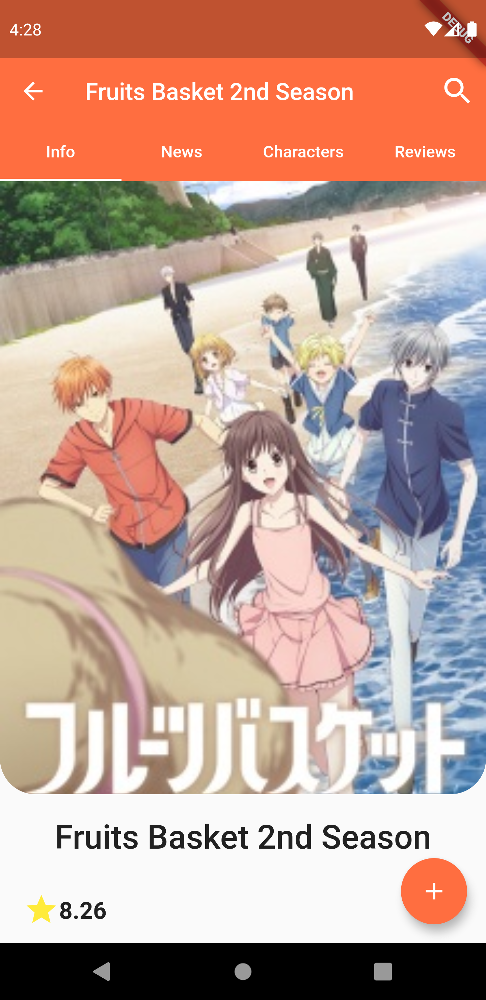
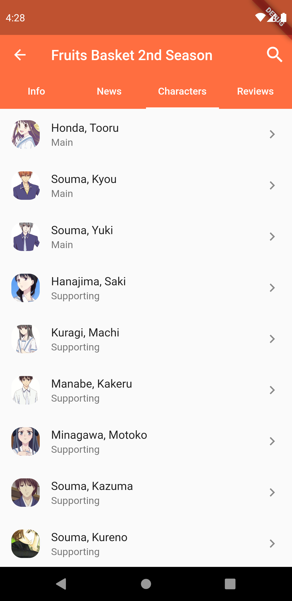
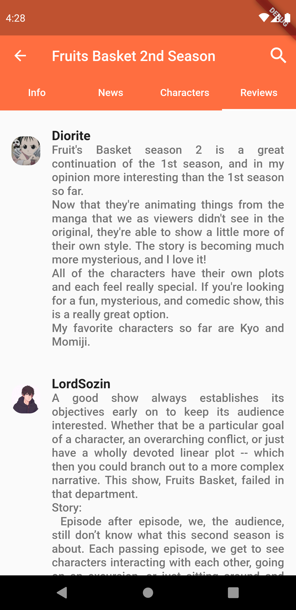

# Ikigai - Anime and Manga encyclopedia.
  
  
<h4 align="center">
  
   
</h4>

  
  

### 1. Download
You can download the apk directly through github, in the future we will launch in other stores.

### 2. Introduction

<b>ikigai</b> has the objective of organizing your favorites anime/manga and keep then always updated, knowing when new episodes will be released and on which days of the week, discovering all that's new in the current season and choosing the best anime/manga to follow, all with lots of extra nerdy information.

### 3. Features  

- Add an anime or manga to your favorites
- View the latest news related to a specific anime or manga
- Extra information about the main and supporting characters of an anime or manga
- User ratings and reviews for a specific anime / manga
- See what's new in the current season
- See the release schedule of the new episodes organized by the days of the week

### 4. Screenshots

  

  

  

  

  

  

## :recycle:  Contribution

Want to contribute? Great!

1. Fork it
2. Create your feature branch (git checkout -b my-new-feature)
3. Commit your changes (git commit -m 'Add some feature')
4. Push to the branch (git push origin my-new-feature)
5. Create new Pull Request

## License

Apache License 2.0

Copyright (c) 2020 Lucas Finoti

[See more about the license][LICENSE]

[LICENSE]: <https://github.com/FinotiLucas/All-Nihon/blob/master/LICENSE>
